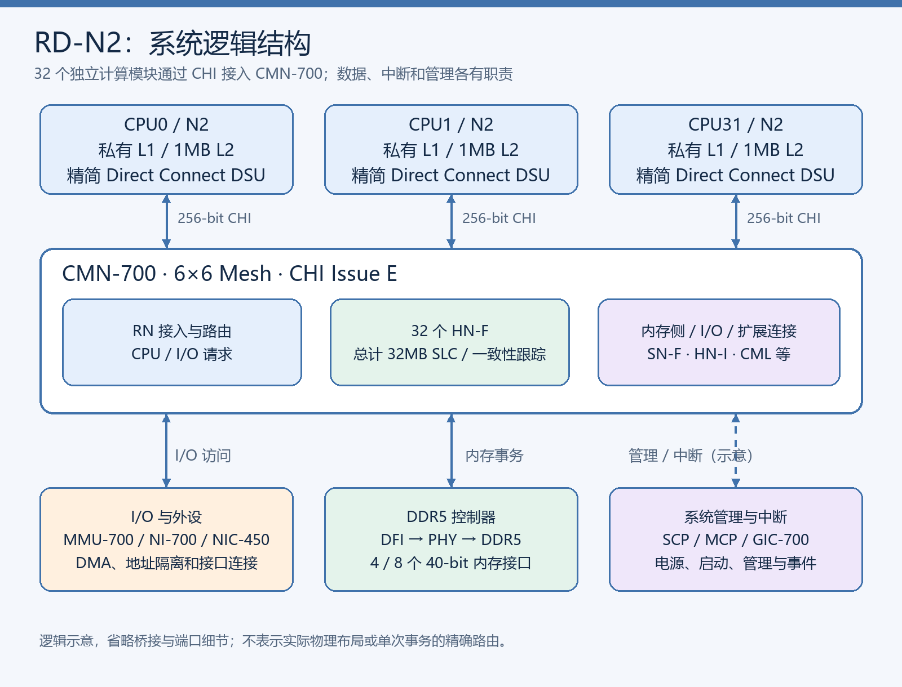
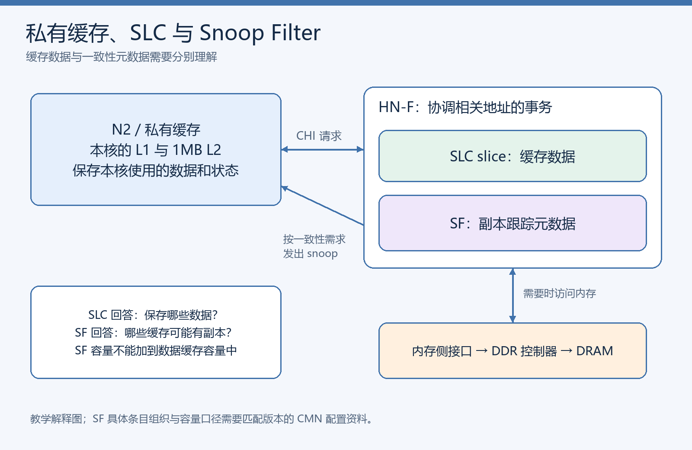
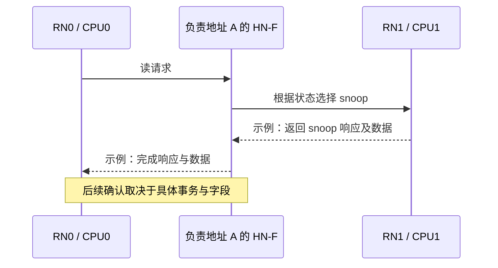
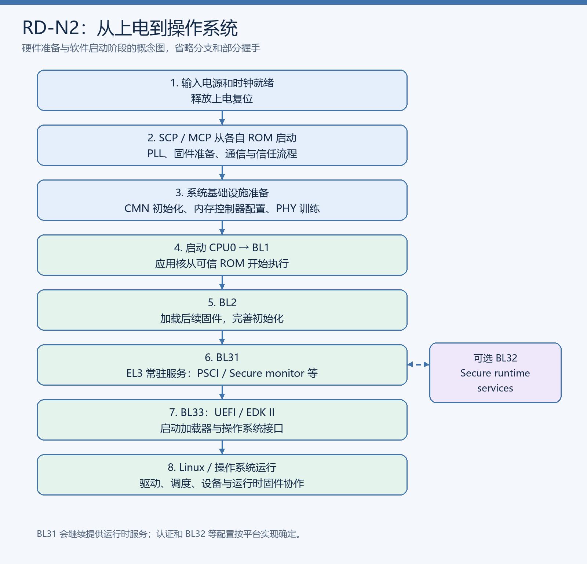
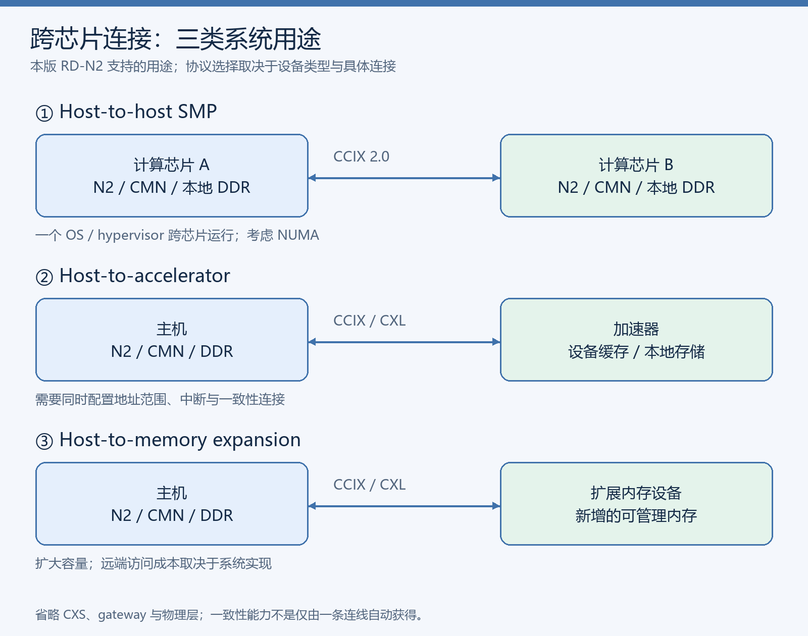

# Neoverse N2 Reference Design：中文精读与系统架构导读

> **阅读目标**：读完本文，能够解释 RD-N2 的 CPU、缓存、一致性互连、DDR、I/O、中断、管理固件和启动过程如何协作，并知道需要进一步查哪一章。
>
> **文档边界**：依据 Arm《Neoverse N2 reference design Technical Overview》，Release D / Issue 04，2022-01-15，487 页。本文是重新组织后的中文解释，不是逐页翻译。硬件配置限定于这一版参考设计；原文未给出的性能、实现参数和选项不作推定。
>
> **标注约定**：“原文依据”指可查证的配置或要求；“理解说明”“教学示例”是帮助理解的解释；“待确认”表示原文存在口径疑问或缺少实现细节。所有页码均为 PDF 印刷页码，从封面第 1 页开始。

原文：[本地 PDF](00_sources/RD-N2-ReleaseD-Technical-Overview.pdf) · [Arm 官方 PDF](https://documentation-service.arm.com/static/61e8008e2183326f21773543)。在 Obsidian 中也可打开 [[RD-N2-ReleaseD-Technical-Overview.pdf]]。

## 阅读导航

- [1. 一页掌握整个设计](#1-一页掌握整个设计)
- [2. 系统总图与模块分工](#2-系统总图与模块分工)
- [3. Processor block 与 Direct Connect](#3-processor-block-与-direct-connect)
- [4. CMN-700、一致性与分布式缓存](#4-cmn-700一致性与分布式缓存)
- [5. 从一次访问理解数据流](#5-从一次访问理解数据流)
- [6. DDR5 与内存控制器](#6-ddr5-与内存控制器)
- [7. I/O、SMMU 与 DMA](#7-iosmmu-与-dma)
- [8. GIC-700 与中断](#8-gic-700-与中断)
- [9. SCP、MCP 与系统管理](#9-scpmcp-与系统管理)
- [10. 时钟、电源、复位与一致性域](#10-时钟电源复位与一致性域)
- [11. 从上电到 Linux](#11-从上电到-linux)
- [12. 安全、可靠性与调试](#12-安全可靠性与调试)
- [13. 多芯片、加速器与内存扩展](#13-多芯片加速器与内存扩展)
- [14. FVP 与软件栈](#14-fvp-与软件栈)
- [15. 地址映射与寄存器](#15-地址映射与寄存器)
- [16. 容易误解的地方与待确认项](#16-容易误解的地方与待确认项)
- [17. 精读顺序、术语与原文索引](#17-精读顺序术语与原文索引)

## 1. 一页掌握整个设计

RD-N2 面向高核心数的基础设施系统，例如云服务器、5G、企业网络设备和 SmartNIC。它展示了如何把 N2 CPU IP 与系统 IP 集成为能够启动操作系统的计算子系统，同时考虑功耗、性能和面积，即 PPA。

**最核心的组织方式是：32 个单核计算模块，以 CHI 接入 CMN-700；CMN-700 提供分布式系统缓存及一致性协调，再连接 DDR 和 I/O。**

### 1.1 关键配置速查

| 项目 | 本版 RD-N2 配置 | 应怎样理解 |
|---|---|---|
| CPU | 32 个 MP1 Neoverse N2 | MP1 表示每个 cluster 只有一个应用处理器核 |
| 指令集 | Armv9.0-A，包含 SVE2 等特性 | 具体加密扩展的可用性受配置控制 |
| 核私有 L2 | 每核 1MB | 32 核共计 32MB 私有 L2，但不会变成一个统一共享 L2 |
| 核到互连 | 每个 Processor block 一个 256-bit CHI 接口 | Direct Connect 模式，通过 CAL 接入 CMN |
| 集群 DSU | 精简 Direct Connect DSU | 保留桥接、调试、电源管理；本配置无集群 L3 和 snoop 控制逻辑 |
| 主互连 | CMN-700，6×6 mesh | 6×6 是 mesh 拓扑尺寸，不是 CPU 核数 |
| 系统缓存 SLC | 32MB，32 个 HN-F，各 1MB | 容量分散在多个 home/cache slice 上 |
| Snoop Filter | 原文概览标称 64MB | 负责一致性跟踪；不能与 SLC 相加当成数据缓存，单位口径见第 16 节 |
| 内存 | DDR5-5600，4 或 8 个 40-bit 接口 | 具体控制器、PHY 和 DIMM 组织需要一起理解 |
| 中断 | GIC-700 | 支持分布式中断控制与虚拟化 |
| I/O 地址管理 | MMU-700，SMMUv3.2 | 为外部 I/O master 提供地址转换和访问隔离 |
| 系统管理 | SCP 与 MCP，均采用 Cortex-M7 | 两者承担不同管理职责 |
| 跨芯片连接 | CCIX 2.0 / CXL 1.1 | 协议能力与设备类型、端口配置有关 |
| 参考实现目标 | 代表性的 5nm 工艺 | 这是参考设计目标，不限定所有 N2 产品的工艺 |

**原文依据**：§2，p.15–16；§3.3.1，p.23–25；§3.4，p.27–30；§3.6，p.34–38。

### 1.2 两种配置的差别

| 配置名 | CPU 与 mesh | 内存接口 |
|---|---|---|
| CFG32C8M | 32 核、6×6 CMN-700 | 8 个 DDR5 40-bit 接口 |
| CFG32C4M | 32 核、6×6 CMN-700 | 4 个 DDR5 40-bit 接口，仅 mesh 一侧启用 |

原文明确表示，除内存接口配置外，两者没有其他差别。不能把 CFG32C4M 理解为“CPU 数量减半”。

**理解说明**：较多内存接口提供更大的潜在并行访问空间，但实际带宽还受内存容量组织、调度、访问分布和工作负载影响；不能仅从接口数量推导实测加速比。

## 2. 系统总图与模块分工



*图 1：重新绘制的逻辑结构图。依据原文 Figure 3-1（p.18）和相关章节；省略部分桥接、调试和扩展信号，不表示物理布局或精确事务路由。*

| 模块 | 主要职责 | 为什么系统需要它 |
|---|---|---|
| Processor block | 运行应用和操作系统，持有私有缓存 | 提供计算能力 |
| CMN-700 | 协调一致性、路由访问、提供 SLC | 多核必须能共享内存并得到正确数据 |
| NI-700 | 高度可配置的非全一致性 NoC，连接 I/O | 外设的接口、带宽和布线需求与 CPU 不同 |
| NIC-450 | AXI 交换/交叉连接，聚合外围设备 | 为寄存器、ROM、SRAM 等提供连接 |
| GIC-700 | 管理与分发中断 | 将设备和处理器事件交给正确的执行上下文 |
| MMU-700 | I/O 地址转换、保护与虚拟化 | DMA 设备只能访问被允许的内存 |
| Dynamic Memory block | DDR 控制器及其管理逻辑 | 将系统事务转换为 DRAM 操作 |
| SCP | 控制启动、电源、时钟、复位 | 让系统按正确顺序进入或退出运行状态 |
| MCP | 管理通信、事件与 RAS | 与外部 BMC 协作维护系统 |
| CoreSight | 调试和追踪 | 定位软件执行与系统交互问题 |

**原文依据**：§3.2，p.17–19；§3.3，p.20–27。

读系统框图时，应把三类路径分别看清楚：**业务数据路径、中断路径、管理控制路径**。它们可能共享部分互连资源，但功能和协议语义不同。例如，DMA 写入内存不等于已经向 CPU 发出完成中断；CPU 被通知后，还需要按照驱动约定读取数据。

## 3. Processor block 与 Direct Connect

### 3.1 一个 Processor block 包含什么

一个 Processor block 包含一个 N2 核、Direct Connect DSU、GIC Cluster Interface（GCI）、调试和时钟/复位控制。RD-N2 实例化 32 个这样的模块。N2 应用核在文档中也称为 AP（Application Processor）。

Direct Connect DSU 保留必要的异步接口桥接、PPU 和调试逻辑；本配置不提供集群级 L3 与 snoop 控制逻辑。每个单核 cluster 通过 CAL（Component Aggregation Layer）接入 CMN-700。

```text
一个计算模块：
N2 核 + 私有缓存
        │
精简 Direct Connect DSU
  桥接 / PPU / 调试 / GCI
        │ 256-bit CHI
       CAL
        │
    CMN-700
```

**原文依据**：§3.4，p.27–30，Figure 3-5，p.29。

### 3.2 Direct Connect 的实际意义

**理解说明**：这套组织方式让每个核以独立计算模块接入共享 mesh。私有缓存的命中由本核处理，跨核共享数据的协调交给系统互连。这样可以围绕重复的 CPU/cache/XP 组合组织物理 tile。

原文给出的 tile 例子包含一个或两个处理器核、一个或两个 HN-F slice 以及一个 XP。调试、计数器和 Utility bus 等接口可以通过 daisy chain 连接，便于重复布局和布线。

“Direct”并不代表接口上不存在桥接、信用流控、时钟域转换或路由；也不代表所有访问都要到 DDR。

### 3.3 本核的重要能力

原文列出 48-bit PA/VA、SVE2、MPAM、AMU、随机数指令、ETE/TRBE 和 CBusy 自适应预取等。对于系统学习，它们可以归为四组：

- **计算**：SVE2 及相关扩展。
- **资源管理**：MPAM、AMU、功耗控制。
- **可观察性**：调试、追踪、RAS。
- **系统连接**：CHI、独立电压/电源管理、同步或异步连接选项。

原文同时说明加密扩展是配置选项，不能把列出的所有算法能力都视为每个最终芯片必然启用。

**原文依据**：§3.4，p.28；§4.7.1，p.112。

## 4. CMN-700、一致性与分布式缓存

### 4.1 CMN 的作用超过“传输总线”

CMN-700 连接不同类型的请求者、home、内存接口与外设端口，协调缓存一致性，并提供路由、QoS、MPAM、RAS 和性能监控能力。RD-N2 采用 CHI Issue E。

**理解说明**：一次访存包含两个不同问题：数据应该从哪里取得，以及多个缓存之间的权限和副本如何变化。Mesh 负责传输，一致性节点负责协调这类事务语义。

### 4.2 必须认清的节点

| 名称 | 在本设计中的理解 | 学习时注意 |
|---|---|---|
| RN-F | 对带一致性缓存的请求者提供接入 | CPU 请求和对 CPU 的 snoop 相关路径 |
| HN-F | 全一致性 home/cache slice | 负责相应地址的协调，包含系统缓存 slice |
| SN-F | CMN 的 CHI 内存侧连接节点/接口 | 连接外部内存控制器；与协议抽象中的 SN 角色一起理解 |
| RN-I | I/O 请求接入 | 可以让 I/O 发起的访问与 CPU 缓存协同 |
| RN-D | 具有 DVM 支持的 I/O 请求节点 | 不应只按普通数据请求理解 |
| HN-I | 下游 I/O 目标连接 | 原文明确其不提供该下游数据的 SLC 缓存及 RN-F snoop |
| HN-P / HN-T | 带 PCIe 优化 / 调试追踪功能的 home 类型 | 用于相应系统用途 |
| XP | Mesh crosspoint | 连接设备端口并传输 mesh 流量 |
| CAL | 设备聚合层 | 聚合设备连接，并不是新增的缓存层级 |

RD-N2 有 32 个 RN-F、32 个 HN-F；每个 HN-F 具有 1MB SLC slice，共 32MB。CFG32C8M 的内存侧使用 8 个 SN-F 连接第三方内存控制器。

**原文依据**：§3.3.1，p.23–26；Figure 3-4，p.25。相关笔记：[[CHI-节点角色与能力]]、[[CHI-架构分层]]。

### 4.3 私有 L2、SLC 与 Snoop Filter 的区别



*图 2：缓存层次与一致性元数据的解释图。箭头表示逻辑关系；示例不是完整 CHI 状态机。*

| 对象 | 核心作用 | 可以把它看成什么 |
|---|---|---|
| 私有 L2 | 保存本核经常使用的数据与缓存状态 | 本核附近的数据工作集 |
| SLC | 保存系统级缓存数据 | 多个请求者可利用的、分布式的数据缓存 |
| Snoop Filter | 跟踪相关缓存副本，帮助缩小 snoop 范围 | 一致性元数据，而不是可供 CPU 读取的额外数据容量 |

**教学示例**：如果 RN0 和 RN1 都缓存过地址 A，系统必须知道哪些请求者可能持有该行。目录/SF 类信息用于判断 snoop 目标；实际数据可能在某个 RN、SLC 或内存。知道“哪里可能有副本”与“自己保存一份数据”是两件事。

不能从“某 RN 的状态是 Clean”单独推出 DDR 一定保存了整个系统最新的数据；还需要看其他副本和 Dirty 责任。参见 [[CHI-所有权与Dirty责任]]。

### 4.4 地址映射与流量分布

CMN 支持 RN SAM、System Cache Group、striping 和路由优化。RN SAM 决定请求依据地址送往哪些目标或目标组；mesh 路由决定报文如何到达对应节点。

**理解说明**：多个 HN-F 分担不同地址的处理，使大量核不会都集中访问同一个 home。内存接口之间也需要合理分布流量。地址热点、home 热点、mesh 热点和 DDR 调度拥塞是不同位置的问题，定位时应逐层检查。

本概览没有给出一套足以复刻全部地址哈希和路由策略的详细算法；实现细节应查匹配版本的 CMN-700 TRM。

**原文依据**：§3.3.1，p.23–25。相关笔记：[[CHI-SAM与目标路由]]。

## 5. 从一次访问理解数据流

> 本节是基于架构的教学示例。为便于学习采用经 HN 的常规路径；不代表 RD-N2 固定使用某种 opcode、forwarding、DMT 或数据分配策略。

### 5.1 本核缓存命中

假设 CPU0 读取 A，所需数据及权限已经在本核缓存中满足，访问可以在私有缓存层次内完成。不能把每次 load 都画成“CPU → CMN → DDR”。

### 5.2 缓存缺失，系统缓存可提供数据

CPU0 的私有缓存无法满足请求后，通过 CHI 发出相应请求。地址映射将请求送往相应 HN-F。HN-F 在完成必要的一致性处理后，可以利用 SLC 数据满足请求。

**关键点**：SLC 有数据并不等于无需检查一致性状态；home 必须保证返回的数据与权限正确。

### 5.3 另一个 CPU 持有最新数据

假设 RN1 持有 A 的最新 Dirty 副本，RN0 要读 A：home 根据一致性信息向 RN1 发出相应 snoop，取得数据或安排转发，再完成对 RN0 的服务。



这解释了为什么 DDR 中的旧副本不能直接作为此次读的正确答案：**一致性协调需要找到符合当前所有权和 Dirty 责任的数据来源**。

若采用 snoop forwarding 或 DMT，数据路径可以缩短。其具体使用条件来自 CHI/CMN 文档，不应从这个概览的系统框图直接推定。参见 [[CHI-直接数据传输]]、[[CHI-Comp与CompAck]]。

### 5.4 必须访问内存

当缓存体系无法提供请求所需数据时，home 将操作送往内存侧；DDR 控制器安排 DRAM 命令，数据随后沿选定路径返回。

```text
RN 请求 → HN-F 一致性处理 → CMN 内存侧连接 → DDR 控制器
                                                   │
                                              PHY / DRAM
```

**理解说明**：CPU request、CHI transaction、DDR command 不具有一一对应关系。缓存命中、请求合并、调度和数据返回优化都会影响下游实际发生的操作。

## 6. DDR5 与内存控制器

### 6.1 内存路径由三个层次组成

```text
系统事务层：      CHI
                  ↓
内存调度层：      DDR5 Memory Controller
                  ↓ DFI
物理连接层：      DDR PHY → DDR5 DRAM / DIMM
```

CHI 描述系统请求及响应；控制器把事务组织为 DRAM 访问；DFI 是控制器与 PHY 间的接口。理解这三个层次，才能区分一致性、内存调度和电气训练问题。

### 6.2 原文对控制器提出的重要要求

Dynamic Memory block 使用第三方 DDR5 控制器。原文列出双 CHI Issue E 接口、256-bit CHI 数据宽度、DFI 5.0、多通道和多种时钟比、读重排、Phase Aware Scheduling、RAS、TrustZone、QoS 与 MPAM 等要求。

Figure 3-23 的示例有两路 CHI 输入、两路 DFI 输出，另外通过 AXI-to-APB 和 DMC Manager 访问控制寄存器。这只是该图的控制器组织示例，不能仅凭图中端口数反推完整 DIMM、rank 和芯片数量。

**原文依据**：§3.11，p.64–66，Figure 3-23，p.65。

### 6.3 CBusy 与 MPAM 为什么有用

原文说明内存控制器可为特定 partition 返回 CBusy，请求者应采取措施，减少该 partition 的 outstanding transactions。它将下游拥塞反馈给上游。

**教学示例**：后台批处理持续占用内存，而在线服务有延迟要求。MPAM 可以对资源进行区分和控制；拥塞反馈可以帮助上游调整请求压力。具体资源分配、QoS 策略和公平性不是由“支持 MPAM”几个字自动保证的。

CBusy 与 RetryAck 不应混用：一个用于忙碌/拥塞反馈，另一个涉及 CHI 请求重试流程。相关笔记：[[CHI-QoS与MPAM]]、[[CHI-信用流控与Request-Retry]]。

### 6.4 接口宽度与容量口径

256-bit CHI 宽度是系统接口数据宽度；40-bit DDR 接口是外部内存侧组织口径，两者不能直接等同。原文涉及 dual-channel DIMM 以及 dual 32-bit / 40-bit channel；实际有效数据宽度、ECC 和控制器实例映射需要结合具体实现确认。

本导读不据此计算整颗芯片的总带宽，避免把不同层次的端口数相乘得到未经证实的数字。

## 7. I/O、SMMU 与 DMA

### 7.1 为什么有三种互连

CMN-700 承担一致性 mesh 和系统缓存；NI-700 采用可配置、分组化的 NoC 连接 I/O；NIC-450 采用 AXI switch/crossbar 连接外围设备。它们对应不同的接口、拓扑、布线和延迟需求。

“NI-700 是非一致性互连”并不意味着经过它的 I/O 永远无法访问 CPU 缓存一致性域。是否获得 I/O coherency，还要看接入 CMN 的节点、事务属性和系统配置。

**原文依据**：§3.3.2–3.3.3，p.26–27。

### 7.2 SMMU 解决什么问题

MMU-700 为外部 I/O master 提供 I/O 虚拟化。它使用分布式 TBU 和 TCU，并支持一阶段或两阶段转换、ATS/PASID 等能力。

| 对象 | 需要记住的职责 |
|---|---|
| TBU | 在请求路径附近缓存并处理地址转换相关工作 |
| TCU | 统一承担转换控制、配置和相关页表遍历工作 |
| Stage 1 | 将 VA 转换到 IPA，或在相应配置中完成到 PA 的转换 |
| Stage 2 | 将 IPA 转换到 PA，支撑虚拟机隔离 |

**教学示例**：虚拟机 A 的网卡队列只能 DMA 到分配给 A 的缓冲区。SMMU 用地址转换和权限检查限制设备可见范围；一致性互连则处理 CPU 和设备访问同一物理数据时的缓存关系。

**地址正确与缓存一致，是两个维度。** 装了 SMMU 并不自动意味着 DMA 与 CPU 缓存一致；I/O coherency 也不代替设备的地址隔离。

**原文依据**：§3.6，p.34–38。

### 7.3 HN-I 下游是一个重要例外

原文明确说明：HN-I 不缓存其下游 I/O slave 的数据到 SLC，也不会为这些访问向 RN-F 发送 snoop。即使处理器缓存了该下游数据，硬件也不会替它维持这条路径的一致性。

所以，“连接到了 CMN”本身不足以证明任意地址、任意端口具有完整硬件一致性；应检查 home 类型和内存属性。

**原文依据**：§3.3.1，p.26。

## 8. GIC-700 与中断

GIC-700 使用分布式 Distributor、Redistributor/GCI 和 ITS。RD-N2 的 GIC 支持 GICv4.1，并具有直接注入虚拟中断等能力。

| 部件 / 名词 | 简明解释 |
|---|---|
| Distributor | 分发共享外设中断等系统中断 |
| Redistributor / GCI | 与各处理器执行接口配合，管理相应的本地中断功能 |
| ITS | 将设备消息中断映射到相应的中断标识与目标 |
| SGI | 核间软件生成中断 |
| PPI | 面向特定处理器的私有外设中断 |
| SPI | 多处理器系统中的共享外设中断 |
| LPI | 与 ITS、消息中断及虚拟化相关的中断类型 |

原文提供 Inline ITS、ITS on the side 和 System ITS 三类连接方式。选项与不同 I/O 路径有关，并不要求全部 ITS 都串在同一条数据路径上。

**教学示例**：PCIe 设备写完缓冲区后产生 MSI/MSI-X；ITS 将设备消息转换为相应中断，GIC 再将事件送给目标处理器或虚拟机。设备的数据访问与这次中断通知是相互配合的两条功能路径。

**原文依据**：§3.5–3.5.1，p.30–34；§4.8.2，p.126–128。

## 9. SCP、MCP 与系统管理

### 9.1 三类处理器承担不同职责

| 处理器 | 主要运行什么 | 主要责任 |
|---|---|---|
| AP：N2 | 启动固件、操作系统和应用 | 业务计算 |
| SCP：Cortex-M7 | 系统控制固件 | 电源、时钟、复位、启动、DVFS、唤醒 |
| MCP：Cortex-M7 | 管理固件 | BMC 通信、事件记录、复位请求和 RAS 管理 |

SCP/MCP 有私有存储和外设，位于 Always-on 的管理区域。系统使用 MHUv2.1 在 AP、SCP、MCP 间交换消息。

**理解说明**：当应用核尚未启动或已经进入低功耗状态时，管理处理器仍然需要协调下一步动作。因此，管理链路不能完全依赖正在被关闭的应用核。

### 9.2 一次电源请求怎样理解

```text
OS / AP 提出状态请求
        ↓ 固件服务、消息通信
       SCP
        ↓ PPU / 时钟 / 电压控制
相关模块执行状态转换
        ↓ 完成通知
OS / 固件继续后续处理
```

上图是功能分工示意，具体 PSCI、MHU 和管理固件协作方式取决于软件实现。原文既讨论 SCP 的底层控制，也讨论 AP 固件提供给 OS 的接口。

**原文依据**：§3.8，p.53–62；§6.2–6.4，p.134–137。

## 10. 时钟、电源、复位与一致性域

### 10.1 三种“域”需要分别理解

| 类型 | 管什么 | 可能发生的变化 |
|---|---|---|
| Clock domain | 时钟及频率 | 门控、频率变化、跨域同步 |
| Voltage / power domain | 电压与供电 | DVFS、power gating |
| Reset domain | 逻辑复位范围 | 局部复位、系统逻辑复位 |

RD-N2 采用 GALS 思路：局部逻辑同步，不同主要时钟域可独立运行。每个核可具有自己的 VCPUn 电压域与 PD_CPUn 电源域；原文也允许多个核共享电压域。系统逻辑使用 VSYS。

### 10.2 SYSTOP 不是整片断电的同义词

本实现的 AONTOP 包含核以外的 Always-on 逻辑；SYSTOP 是系统逻辑的复位域。原文明确说明 SYSTOP PPU 在本实现中作为 reset controller，而不是一个独立的系统逻辑 power-gating controller。

因此，PPU 状态表中的 `OFF` 必须结合具体 PPU 和域类型解释，不能把所有 `OFF` 都理解为“物理电源被切断”。SLC/SF RAM 又有单独的内部管理方式，且本实现不支持它们的 memory retention。

**原文依据**：§4.3.1–4.3.3，p.83–90。

### 10.3 为什么关核需要处理缓存

关闭一个核时，必须考虑架构状态、缓存数据、中断和一致性域成员身份。若把仍拥有 Dirty 数据或仍可能响应 snoop 的核直接断电，其他请求者可能无法取得正确数据或完成事务。

原文给出的下电流程涉及保存上下文、按要求 flush cache、管理中断、发送 MHU 消息、WFI、PPU 转换和退出一致性域。动态下电通过撤销 SYSCOREQ 退出一致性域；唤醒后恢复状态并重新进入一致性域。

**理解说明**：电源管理与 CHI 生命周期直接相关。WFI 是流程中的事件条件之一，不能仅凭执行 WFI 就认定所有数据和协议状态都已经安全收尾。

**原文依据**：§4.3.7，p.93–95。相关笔记：[[CHI-链路与一致性域生命周期]]。

### 10.4 更大范围的休眠

原文的 SYSTOP OFF 流程依次考虑：所有应用核已关闭、相关 I/O 已 quiesce、保存系统/SRAM 状态、关闭 SLC/SF、控制内存低功耗与 DDR self-refresh、设置系统 PPU、停止适用 PLL。

这里的重点是依赖关系：**先停止可能产生新访问的主体，再保存或处理状态，最后关闭相应服务能力。** 不能一边让 DMA 继续产生访问，一边关掉其依赖的系统。

**原文依据**：§4.3.6，p.92–93。

## 11. 从上电到 Linux



*图 3：依据 §4.6.1、§6.4 重新绘制的阶段图。原文将硬件流程标为示例；认证和 BL32 等步骤存在可选或实现相关部分。*

### 11.1 管理处理器先准备系统

原文示例先满足供电和输入时钟，再释放上电复位。SCP、MCP 分别从自己的 ROM 启动，建立通信并完成相关固件准备；SCP 配置 SYSPLL 并等待锁定。

后续流程包括加载管理固件、按实现进行认证、建立信任通信、启动 AP PLL、处理 SYSTOP，初始化 CMN、内存控制器并训练 PHY，然后启动 CPU0。

**重要理解**：AP 要运行后续固件，必须先有可用的时钟、复位状态和关键存储路径；系统启动因此具有跨模块依赖。

### 11.2 AP 固件各阶段的责任

| 阶段 | 在本概览中的作用 |
|---|---|
| BL1 | 片上可信 ROM 中的最小启动代码 |
| BL2 | 加载后续固件，完善可信环境初始化 |
| BL31 | 常驻的 EL3 固件服务，包括 PSCI、Secure monitor 等 |
| BL32 | 可选 Secure runtime services |
| BL33 | 非安全启动加载器，例如 UEFI/EDK II |
| OS | 通过启动加载器进入 Linux 等操作系统 |

这些名称不代表五个阶段必然像普通程序一样依次结束退出。尤其 BL31 会在系统运行期间继续提供服务；BL32 是否存在取决于平台需求。

原文还指出 Linux 利用 UEFI、ACPI 和 SMBIOS 提供的表获取系统信息。

**原文依据**：§4.6，p.109–111；§6.4–6.5，p.136–138。

## 12. 安全、可靠性与调试

### 12.1 安全属性必须沿整条路径传播

原文描述 Secure/Non-secure 属性在 CHI、AXI/ACE-Lite 和 APB 路径上的传递，分别涉及 CHI `NS`、AXI `AxPROT[1]` 与 APB `PPROT`。外围设备或互连访问控制逻辑决定是否允许相应访问。

**理解说明**：CPU 的安全状态只是访问源头之一；从请求者到目标，属性传播、地址区域配置和目标端权限检查需要一致。SMMU 与内存控制器也参与保护设备和内存访问。

### 12.2 SCP 与 MCP 的安全口径

原文 §4.7.4 将 SCP 的访问视为 Secure，§4.7.5 将 MCP 的访问视为 Non-secure；两者采用的 Cortex-M7 及相关调试逻辑不直接支持 TrustZone。

这说明“参与可信启动”“被纳入可信管理流程”和“事务带 Secure 属性”属于不同层次。不能因为两者都参与启动，就把全部 MCP 访问标成 Secure。

**原文依据**：§4.7，p.111–113。

### 12.3 RAS 与可观察性

RAS 指可靠性、可用性与可维护性。原文在多个系统模块中讨论错误检查、报告和管理；MCP 可扩展为与 BMC 通信，记录事件并发送告警。

CoreSight 提供系统与核的调试/追踪连接，涉及外部调试、认证、ROM table、trace sources、cross trigger、STM 和 self-hosted debug。

**理解说明**：性能监控、错误报告和执行追踪回答的是不同问题：系统为什么慢、是否发生硬件故障、代码和事务如何走到当前状态。不能仅看一个 CPU 利用率指标就替代这些观测能力。

**原文依据**：§3.7，p.38–53；§3.8.2，p.59–61；§6.3，p.135。

## 13. 多芯片、加速器与内存扩展



*图 4：原文 §4.8 的三类用途。只示意连接关系，省略 gateway、CXS 和物理层；CXL、CCIX 的可用能力取决于设备类型与具体连接。*

### 13.1 三类用途应分别理解

| 用途 | 本版设计中的要点 | 软件需要理解什么 |
|---|---|---|
| Host-to-host SMP | 用 CCIX 2.0 连接计算芯片，支持最多 4 个 chiplet | 一个 OS/hypervisor 管理多芯片处理器和内存 |
| Host-to-accelerator | 用适用的 CCIX/CXL 连接加速器 | 地址范围、设备 DMA、中断与一致性关系 |
| Host-to-memory expansion | 扩展系统可管理的内存 | 远端内存可具有不同延迟和带宽 |

原文这里的 SMP 表示单个操作系统或 hypervisor 跨芯片运行，并不要求所有处理器核完全相同。多芯片使用各自内存区域与 RN SAM 配置，可表现为 NUMA 系统。

### 13.2 CHI、CXS、CCIX/CXL 各在什么层次

```text
芯片内：  CPU / CMN 的 CHI 一致性通信
                  ↓ 跨芯片相关桥接
边界上：  CXS 传输接口
                  ↓
芯片间：  CCIX 或适用的 CXL 协议 + 物理传输
```

**理解说明**：CHI 是芯片内一致性接口的关键协议；跨芯片还需要相应的协议桥接、代理与物理传输。不能把一个 CCIX/CXL 链路画成没有任何转换的长距离 CHI 电线。

### 13.3 多芯片需要协调的不只是数据

除了缓存一致性和远端内存访问，还需要统一芯片标识、地址映射、中断路由、计时同步、启动和电源管理通信。原文讨论全局 GIC、通过 PUB/CML 传输相关消息，以及主从芯片间的 generic timer 同步。

**教学示例**：即使 CPU0 能读取 Chip1 的 DRAM，如果 OS 还不知道远端核的拓扑或中断目标，多芯片系统仍不能作为完整平台正常工作。

**原文依据**：§4.8，p.113–128；§6.6，p.138。

## 14. FVP 与软件栈

### 14.1 FVP 是提前开发的平台

FVP（Fixed Virtual Platform）用于在硬件可用前开展软件和架构功能开发。原文模型覆盖 N2、CMN-700、NIC-450、GIC-700、MMU-700、SCP/MCP 和内存访问路径等部分。

| 对象 | 本版原文中的核数 |
|---|---|
| RD-N2 参考硬件 | 32 核 |
| 单芯片 FVP | 16 核，缩减的 CFG32C4M |
| 四芯片 FVP | 每芯片 4 核，总计 16 核 |

FVP 不建模所有 RD-N2 组件，原文明确举例不包含 CoreSight 技术组件。功能模型也不能被当成真实芯片延迟、带宽或功耗的测量替代物。

**原文依据**：§5，p.129–132。后续软件版本可能有其他配置，应与本版区分。

### 14.2 完整软件平台有哪些层

```text
应用 / Linux
    ↑ 平台信息、驱动与运行时服务
UEFI / AP Trusted Firmware
    ↔ SCP / MCP 管理固件
    ↓
CPU、互连、中断、SMMU、内存与外设
```

原文 BSP 包括 SCP firmware、MCP firmware、AP firmware（Trusted Firmware 与 UEFI）以及 Linux。Linux 侧涉及多处理器调度、设备驱动及 UEFI/ACPI/SMBIOS 支持。

**理解说明**：设计一个能跑 Linux 的 SoC，需要硬件、启动固件、描述表和驱动协作；仅连接 CPU 和 DDR 仍然缺少平台服务。

**原文依据**：§6，p.133–138。

## 15. 地址映射与寄存器

### 15.1 第 7 章的使用方式

第 7 章是查阅手册：先确认访问者和地址空间，再找目标模块的基址、偏移、权限、复位值和寄存器副作用。AP、SCP、MCP 各有地址映射；SCP/MCP 访问 AP 空间涉及地址重映射。

本导读保留有助于定位的入口，不逐项复制所有寄存器。具体写寄存器时应回到原表。

### 15.2 几个有用的地址入口

以下是 AP 视角的部分地址窗口，来自 Table 7-1；**窗口大小不是物理 RAM/ROM 容量证明**。

| AP 地址范围 | 用途 | 查阅重点 |
|---|---|---|
| `0x00_1000_0000–0x00_1FFF_FFFF` | DMC 控制器区域 | 控制寄存器，与 DRAM 数据区分开 |
| `0x00_2000_0000–0x00_21FF_FFFF` | Cluster Utility | 每个 Processor block 对应 1MB 窗口 |
| `0x00_2A40_0000–0x00_2A40_FFFF` | AP Non-secure UART | 调试输出入口之一 |
| `0x00_4000_0000–0x00_4FFF_FFFF` | I/O 虚拟化区域 | SMMU 相关配置 |
| `0x00_5000_0000–0x00_5FFF_FFFF` | 为 CMN 配置预留的空间 | 与实际 GPV 窗口分别核对 |
| `0x01_4000_0000–0x01_7FFF_FFFF` | CMN-700 GPV | 实际互连配置空间入口 |

**原文依据**：§7.2.1，p.140–146，特别是 p.144–145。

### 15.3 Cluster Utility 的规律

Processor block 0 从 `0x00_2000_0000` 开始；每增加一个 block，基址增加 `0x0010_0000`，即 1MB。这个窗口中有 cluster control、cluster PPU、core manager、clock control、core PPU、AMU 等子区域。

**教学计算**：若访问 Processor block 2 的 Core Manager/clock-control 窗口，其 block 基址为 `0x00_2020_0000`，窗口偏移为 `0x0005_0000`，得到窗口起点 `0x00_2025_0000`。某个具体寄存器地址还必须再加该寄存器偏移，并核对权限。

**原文依据**：§7.2.1.1，p.146，Table 7-2 / 7-3。

### 15.4 寄存器阅读规则

| 类型 | 含义 | 常见错误 |
|---|---|---|
| RO | 只读 | 将读出的配置值当成可写控制项 |
| RW | 可读写 | 不核对保留位和权限就整字覆盖 |
| WO | 只写 | 试图通过读回验证全部状态 |
| RAZ / WI | 读零 / 忽略写入 | 把读零当成硬件一定不存在 |
| RW1C | 写 1 清除相应位 | 当成普通 RW 使用 read-modify-write |

原文要求不要访问保留/未使用地址，不要修改未定义位。未映射区域与违反安全属性的访问可能返回 DECERR；APB 等下游目标的错误表现还要按原表和接口核对。

**原文依据**：§7.1，p.139；§7.2.1，p.142。

## 16. 容易误解的地方与待确认项

### 16.1 已有明确依据的纠正

| 容易产生的理解 | 应采用的理解 |
|---|---|
| 6×6 mesh 就是 36 个 CPU | Mesh 尺寸与 CPU 数量属于不同配置维度；此处是 32 核 |
| Direct Connect 完全没有 DSU | 使用精简 DSU；没有本配置中的集群 L3/snoop 控制逻辑 |
| 32MB SLC 就是每核都拥有 32MB | 容量分布在 HN-F，属于系统级资源 |
| 32MB SLC + 64MB SF = 96MB 数据缓存 | SF 是一致性元数据，不能作为数据缓存容量相加 |
| 经过非一致性 NI 就必然无法 I/O coherent | 要看进入 CMN 的接入节点及事务属性 |
| HN-I 和 HN-F 只差名字 | HN-I 下游不提供 HN-F 那种缓存与 snoop 协调 |
| SMMU 解决了缓存一致性 | SMMU 的地址转换/隔离与缓存一致性属于不同职责 |
| SYSTOP OFF 就是系统物理断电 | 本实现的 SYSTOP PPU 是 reset controller |
| 单芯片 FVP 就是完整 32 核硬件 | 本版 FVP 缩减为 16 核，并未建模全部组件 |
| CHI E、AXI/ACE H 都指 CHI H | 它们是不同规范的 issue 编号 |

### 16.2 待确认：64MB Snoop Filter 的具体口径

原文 p.15 写有 64MB Snoop Filter，但这份概览未在该处解释容量单位如何对应 tracking coverage、条目数及物理 RAM 大小。本文保留原文标称，不推定它是 64MB 物理 SRAM。

**待确认**：应查匹配版本 CMN-700 TRM 或配置资料，确认该 RD 配置的 SF 条目组织和覆盖能力。

### 16.3 待确认：多芯片地址上界不一致

原文 p.115 的四芯片例子将 Chip2 上界写成 `0xCFF_FFFF_FFFF`，与下一段 Chip3 从 `0xC00_0000_0000` 开始的区间有重叠；而 p.130 和 p.143 给出的 Chip2 上界为 `0xBFF_FFFF_FFFF`。

**待确认**：这可能是原文笔误。本文不将 p.115 的重叠区间用作地址配置依据，也不自行发布一个“已修正的官方范围”。实现时应核对勘误、平台固件与实际 memory map。

### 16.4 待确认：概览不足以确定的实现参数

以下内容需要其他资料，不能从本概览直接得到：

- 最终芯片频率、面积、功耗和工作负载性能。
- 全部 SLC 分配、替换、包容性和目录维护策略。
- 所有地址哈希、home 选择和条带化参数。
- 每个具体事务是否采用 forwarding、DMT、DCT 或分离响应。
- 所有 I/O、DDR 端口的最终实例化和外设连接。
- 后续 RD-N2 / CSS N2 / FVP 版本相对 Release D 的变化。

### 16.5 与当前 CHI 知识库的版本关系

本参考设计使用 **CHI Issue E**。现有 [[CHI-MOC]] 的规范来源为 **Issue H**。用 H 的笔记帮助理解系统概念时，应先确认规则、字段和 opcode 是否在 E 中存在并被该 IP 实现支持。

不能将后来增加的机制直接当成本版 RD-N2 具备的功能。参见 [[CHI-版本变化]]。

## 17. 精读顺序、术语与原文索引

### 17.1 四条阅读路径

| 你的目标 | 建议顺序 |
|---|---|
| 看懂系统架构 | 本文 1–4 → 原文 Figure 3-1 / 3-4 / 3-5 |
| 将 CHI 放到真实系统中理解 | 本文 3–7 → 原文 §3.3 / §3.4 / §3.11 → CHI 事务规则 |
| 理解系统启动和低功耗 | 本文 9–11 → 原文 §4.3 / §4.6 / §6.4 |
| 开始固件或寄存器开发 | 本文 14–15 → 原文 §7.2 / §7.3 / 对应 §7.4 子节 |

### 17.2 术语速查

| 缩写 | 英文 | 中文与用途 |
|---|---|---|
| RD | Reference Design | 参考设计 |
| PPA | Power, Performance, Area | 功耗、性能、面积 |
| AP | Application Processor | 应用处理器，此处为 N2 核 |
| MP1 | 单核 cluster 配置名 | 每个 cluster 一个应用核 |
| DSU | DynamIQ Shared Unit | 集群共享/接口单元，本配置采用精简模式 |
| CMN | Coherent Mesh Network | 一致性 mesh 互连 |
| SLC | System Level Cache | 系统级缓存 |
| SF | Snoop Filter | 一致性副本跟踪元数据 |
| SAM | System Address Map | 系统地址映射 |
| CAL | Component Aggregation Layer | 设备聚合层 |
| XP | Crosspoint | Mesh 交叉连接点 |
| SMMU | System Memory Management Unit | I/O 地址转换和保护 |
| TBU / TCU | Translation Buffer / Control Unit | 转换缓冲 / 转换控制单元 |
| GIC | Generic Interrupt Controller | 通用中断控制器 |
| ITS | Interrupt Translation Service | 中断转换服务 |
| SCP / MCP | System / Manageability Control Processor | 系统控制 / 可管理性控制处理器 |
| MHU | Message Handling Unit | 处理器间消息通信 |
| PPU | Power Policy Unit | 电源策略/状态控制单元 |
| DVFS | Dynamic Voltage and Frequency Scaling | 动态电压频率调整 |
| DFI | DDR PHY Interface | DDR 控制器到 PHY 的接口 |
| RAS | Reliability, Availability, Serviceability | 可靠性、可用性、可维护性 |
| MPAM | Memory System Resource Partitioning and Monitoring | 内存系统资源分区和监控 |
| PSCI | Power State Coordination Interface | OS 与固件间的电源状态协调接口 |
| FVP | Fixed Virtual Platform | 硬件可用前的软件开发模型 |
| NUMA | Non-Uniform Memory Access | 不同内存位置具有不同访问成本 |

### 17.3 原文重点索引

| 问题 | 原文位置 |
|---|---|
| 核心配置、两个内存配置 | §2，p.15–16 |
| 系统总图 | Figure 3-1，p.18 |
| CMN 节点与 mesh | §3.3.1，p.23–26；Figure 3-4，p.25 |
| Direct Connect / N2 接口 | §3.4，p.27–30；Figure 3-5，p.29 |
| GIC 与 ITS 连接 | §3.5，p.30–34 |
| SMMU 与 I/O 虚拟化 | §3.6，p.34–38 |
| CoreSight 调试 | §3.7，p.38–53 |
| SCP / MCP / MHU | §3.8，p.53–62 |
| DDR 控制器 | §3.11，p.64–66；Figure 3-23，p.65 |
| 时钟、计数器与定时器 | §4.1–4.2，p.67–82 |
| 电源、复位及关核 | §4.3–4.4，p.82–100 |
| 顶层扩展接口 | §4.5，p.101–109 |
| 启动与安全 | §4.6–4.7，p.109–113 |
| 多芯片场景 | §4.8，p.113–128 |
| FVP | 第 5 章，p.129–132 |
| 软件栈 | 第 6 章，p.133–138 |
| 地址映射 | §7.2，p.139–165 |
| 中断映射 | §7.3，p.165–174 |
| 寄存器详细定义 | §7.4，p.174–486 |

### 17.4 寄存器按任务查阅

| 开发任务 | 寄存器组起始位置 |
|---|---|
| 确认系统、芯片 ID 和配置 | §7.4.1，p.175 |
| 系统计数器和定时器 | §7.4.2–7.4.4，p.184 / 204 / 218 |
| Watchdog | §7.4.5，p.234 |
| Base SRAM ECC / RAS | §7.4.6，p.249 |
| MHU 通信 | §7.4.7，p.259 |
| Core Manager 与时钟 | §7.4.8，p.283 |
| 系统和调试 PIK | §7.4.9–7.4.10，p.311 / 345 |
| Debug Chain 电源控制 | §7.4.11，p.373 |
| MSCP 电源控制 | §7.4.12，p.386 |
| DMC Manager | §7.4.13，p.434 |
| PCIe 集成控制 | §7.4.14，p.438 |

### 17.5 已有知识库中的相关笔记

- 节点与通信：[[CHI-节点角色与能力]]、[[CHI-通道与方向]]、[[CHI-SAM与目标路由]]。
- 缓存与数据：[[CHI-Cache状态模型]]、[[CHI-所有权与Dirty责任]]、[[CHI-直接数据传输]]。
- 完成与流控：[[CHI-Comp与CompAck]]、[[CHI-信用流控与Request-Retry]]。
- 系统管理：[[CHI-QoS与MPAM]]、[[CHI-链路与一致性域生命周期]]、[[CHI-错误分类与传播]]。

本文件可独立阅读。上述链接用于继续学习相关 CHI 规则，不作为本版 RD-N2 所有具体实现能力的证明。
